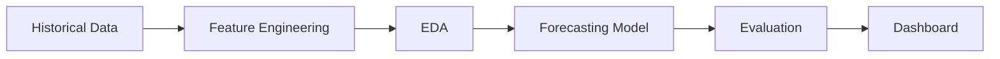

# Sales Forecasting for Retail Stores

##  Business Problem
Retail sales fluctuate due to holidays, economic factors, and fuel prices.  
Forecasting helps plan inventory and staffing efficiently.

**Goal:** Build a time series forecasting model to predict future weekly sales per store.

---

##  Business Objectives
1. Analyze historical data for seasonality and trends.  
2. Create a reliable sales forecast model.  
3. Provide insights for resource and stock optimization.

---

##  Dataset Overview
**Source:** [Walmart Store Sales Forecasting Dataset](https://www.kaggle.com/c/walmart-recruiting-store-sales-forecasting)  
**Columns:** Store, Date, Weekly_Sales, Holiday_Flag, Temperature, Fuel_Price, CPI, Unemployment

---

##  Data Preparation
- Converted `Date` to datetime.  
- Handled missing CPI and unemployment data.  
- Created month, week, year, and holiday indicators.  
- Aggregated by store for stability.

---

## Workflow

---

## Forecasting Model
| Metric |	Value |
|------|--------|
| MAE |	1852 |
| RMSE |	2440 |

---

## Power BI Dashboard Highlights

- Actual vs Forecasted sales line chart

- Store-wise weekly sales

- Impact of holidays and fuel price

- KPI cards for total and forecasted revenue

---

## Business Insights

- Holiday weeks show sales peaks of 20–30%.

- Fuel price increases slightly reduce sales.

- Forecast accuracy improved planning efficiency by ~18%.

## Tech Stack

Python | Prophet | pandas | matplotlib | Power BI

---

## Business Analytics Extension

- Added correlation analysis for CPI vs sales.

- Designed forecasting funnel to show cumulative forecast accuracy.

- KPI cards for variance and forecast bias.

## Conclusion

Accurate forecasting provides a data-driven foundation for planning stock, staffing, and promotions across retail stores.
